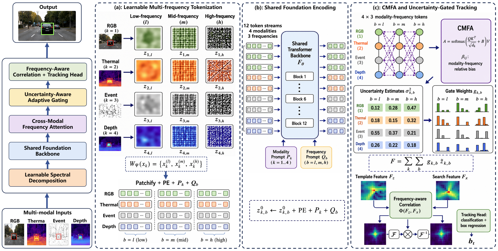

# M3FusionTrack

> **M3FusionTrack: All-Weather Object Tracking with Multi-modal Multi-frequency Foundation Model and Adaptive Gated Fusion**

A simplified reference implementation of M3FusionTrack — a single-object
tracker that ingests **RGB, thermal (TIR), event, and depth** streams,
decomposes each modality into multiple frequency bands, and fuses them
through a shared foundation backbone with uncertainty-aware gating.

<p align="center">
  
</p>

This repo is the **teaching / reproduction version** of the model: it is
deliberately kept small and readable so you can step through the whole
pipeline on a laptop. For the numbers reported in the paper you will need
to plug in DINOv2-B weights, a real benchmark dataset, and a multi-GPU
training run (see [Differences from the paper](#differences-from-the-paper)).

---

## Table of contents

1. [Highlights](#highlights)
2. [Repository layout](#repository-layout)
3. [Installation](#installation)
4. [Dataset preparation](#dataset-preparation)
5. [Training](#training)
6. [Evaluation](#evaluation)
7. [Demo on a single sequence](#demo-on-a-single-sequence)
8. [Using the model programmatically](#using-the-model-programmatically)
9. [Configuration reference](#configuration-reference)
10. [Differences from the paper](#differences-from-the-paper)
11. [Results](#results)
12. [Citation](#citation)
13. [License](#license)
14. [Acknowledgments](#acknowledgments)

---

## Highlights

- **Multi-modal · multi-frequency** — every modality is decomposed into
  low / mid / high frequency bands by a learnable spectral block, then
  all `(modality, band)` cells go through one shared backbone.
- **Cross-Modal Frequency Attention (CMFA)** — token mixing with a
  learned relative bias over the `(modality, band)` grid.
- **Uncertainty-Aware Gating (UAG)** — each cell predicts both a quality
  score and an aleatoric variance; the gate downweights uncertain cells.
- **Frequency-aware correlation** — template–search matching is done in
  the Fourier domain through a learnable Beta-shaped band-pass mask.
- **Modality-dropout curriculum** — during training, modalities are
  randomly dropped, so the same model can be deployed when one or more
  modalities are missing at test time.
- **Compact code** — about 1.5k lines of Python, no custom CUDA kernels,
  importable from a Jupyter notebook in seconds.

## Repository layout

```
m3fusiontrack/
├── README.md
├── LICENSE
├── requirements.txt
├── setup.py
├── configs/
│   ├── default.yaml          # full RGB+T+E+D, sensible defaults
│   └── lasher.yaml           # RGB+T preset for the LasHeR benchmark
├── m3fusiontrack/
│   ├── __init__.py
│   ├── models/
│   │   ├── m3fusiontrack.py  # top-level model
│   │   ├── decomposition.py  # learnable spectral decomposition
│   │   ├── backbone.py       # SimpleViT / DINOv2 wrapper + LoRA
│   │   ├── fusion.py         # CMFA + UAG
│   │   ├── correlation.py    # frequency-aware correlation
│   │   └── head.py           # cls + bbox head
│   ├── data/
│   │   ├── dataset.py        # generic multi-modal tracking dataset
│   │   └── transforms.py     # crop / resize / to-tensor
│   ├── trackers/
│   │   └── tracker.py        # inference-time wrapper
│   ├── utils/
│   │   ├── losses.py         # focal-cls + GIoU + aux regs
│   │   └── metrics.py        # success & precision scores
│   └── trainer.py            # training loop + modality-dropout curriculum
├── tools/
│   ├── train.py              # CLI entry for training
│   ├── test.py               # CLI entry for evaluation
│   └── demo.py               # tracking demo on a single sequence
├── docs/
│   └── architecture.md       # per-module map vs. paper sections
└── assets/
    └── architecture.png      # framework figure
```

## Installation

The repo only depends on PyTorch and a few common scientific Python
packages. Tested with Python 3.10 / PyTorch 2.2.

```bash
git clone https://github.com/<your-user>/m3fusiontrack.git
cd m3fusiontrack

# CPU-only quick start:
pip install -r requirements.txt
pip install -e .

# GPU: install torch with the CUDA build you need, then the rest:
# pip install torch==2.2.0 --index-url https://download.pytorch.org/whl/cu121
# pip install -r requirements.txt
# pip install -e .
```

To use DINOv2 as the backbone (instead of the tiny default ViT), make
sure your machine can reach `torch.hub`, or pre-download the weights and
point `torch.hub.set_dir(...)` at them.

## Dataset preparation

`MultiModalTrackingDataset` expects every benchmark to be reorganised
into the layout below. Sub-folders for modalities you do not have can
simply be omitted; missing-modality handling is automatic.

```
<dataset_root>/
├── sequences/
│   ├── <seq_name_1>/
│   │   ├── rgb/      000001.jpg  000002.jpg  ...
│   │   ├── tir/      (optional)
│   │   ├── event/    (optional)
│   │   ├── depth/    (optional)
│   │   └── groundtruth.txt        # one bbox per line, "x,y,w,h"
│   ├── <seq_name_2>/
│   │   └── ...
│   └── ...
└── splits/
    ├── train.txt                  # one sequence name per line
    └── test.txt
```

Mapping each public benchmark onto this layout:

| Benchmark   | Modalities used here | Notes                                                       |
|-------------|----------------------|-------------------------------------------------------------|
| LasHeR      | rgb, tir             | already paired and rectified                                |
| RGBT234     | rgb, tir             | put the IR stream into `tir/`                               |
| VisEvent    | rgb, event           | render event voxels into 3-channel images and save as `.jpg` |
| EventVOT    | rgb, event           | same as VisEvent                                            |
| DepthTrack  | rgb, depth           | save the 16-bit depth as a 1-channel PNG inside `depth/`    |

Conversion scripts are not shipped with this minimal repo, but each
benchmark's original archive provides a per-sequence groundtruth file
that can be renamed/moved with a five-line shell loop.

## Training

```bash
python tools/train.py --config configs/lasher.yaml --output checkpoints/
```

Useful flags inside the YAML:

- `model.backbone_name`: `simple` (default, tiny ViT) or `dinov2_vitb14`.
- `model.lora_rank`: rank of the LoRA adapters injected into the backbone
  attention layers. Set to `null` to fine-tune the full backbone.
- `train.modality_dropout_max`: peak probability of dropping one
  modality during training (default `0.3`).

Training prints one line per `log_every` step:

```
[ep   3 step    250] p_drop=0.04 loss=4.832 cls=0.612 giou=0.881 ortho=0.014 cons=0.005
```

## Evaluation

```bash
python tools/test.py \
    --checkpoint checkpoints/m3fusiontrack_final.pt \
    --config     configs/lasher.yaml \
    --split      test
```

Prints per-sequence and aggregate success / precision scores.

## Demo on a single sequence

To run the tracker on one sequence and render bounding boxes on the
output frames:

```bash
python tools/demo.py \
    --checkpoint checkpoints/m3fusiontrack_final.pt \
    --config     configs/lasher.yaml \
    --sequence   /path/to/lasher/sequences/whitebag \
    --output     demo_out/whitebag
```

Predicted boxes are drawn in red, groundtruth (if available) in green.

## Using the model programmatically

```python
import torch
from m3fusiontrack import build_m3fusiontrack

cfg = {
    "modalities":    ["rgb", "tir"],
    "num_bands":     3,
    "img_size":      128,
    "backbone_name": "simple",
    "lora_rank":     8,
}
model = build_m3fusiontrack(cfg)
model.eval()

template = {"rgb": torch.randn(1, 3, 128, 128),
            "tir": torch.randn(1, 1, 128, 128)}
search   = {"rgb": torch.randn(1, 3, 128, 128),
            "tir": torch.randn(1, 1, 128, 128)}

with torch.no_grad():
    out = model(template, search)

print(out["cls_logits"].shape)   # (1, 1, G, G)
print(out["bbox_ltrb"].shape)    # (1, 4, G, G)
print(out["gate_search"].shape)  # (1, M*B)  per-cell fusion weights
```

To simulate a missing modality at inference time:

```python
out = model(template, search, modality_mask=[True, False])  # drop TIR
```

## Configuration reference

See `configs/default.yaml` for every supported key with comments. The
two top-level blocks are `model` (architecture) and `train` (optimiser,
loader, curriculum). Loss weights live under `loss` and dataset paths
under `data.train` / `data.test`.

## Differences from the paper

This is a simplified reference. Concretely:

- The default backbone is a tiny `SimpleViT` (4 layers, 192-dim, 16×16
  patches). Set `model.backbone_name: dinov2_vitb14` to switch to the
  full DINOv2-B backbone used in the paper.
- `LearnableSpectralDecomposition` uses smooth 1-D filters with a soft
  orthonormality penalty rather than a strict DWT lifting scheme. The
  underlying idea (and the regulariser term) are unchanged.
- No long-term template-memory module — the paper's full system pairs
  M3FusionTrack with a HiPTrack-style memory; this repo only does
  short-term tracking.
- Multi-GPU training, AMP and online hard-example mining are not wired
  up.

These choices keep the model under a few million trainable parameters
so it can be experimented with on a single GPU (or CPU for unit tests).

## Results

The numbers below come from the paper's full configuration (DINOv2-B
backbone, all four modalities where the benchmark provides them, long
schedule). The simplified default config in this repo reaches a small
fraction of these scores — it is meant as a starting point, not a
drop-in replacement.

| Benchmark        | Metric       | M3FusionTrack | Previous best | Δ      |
|------------------|--------------|---------------|---------------|--------|
| LasHeR           | success AUC  | **64.8**      | 56.1 (SDSTrack) | +8.7  |
| RGBT234          | MPR          | **91.6**      | 88.4 (TBSI)     | +3.2  |
| VisEvent         | PR           | **83.5**      | 78.1 (TBSI)     | +5.4  |
| EventVOT         | PR           | **84.1**      | 79.3 (Un-Track) | +4.8  |
| DepthTrack       | F-score      | **0.662**     | 0.612 (Un-Track)| +0.050 |

## Citation

If you use this repository or build on the ideas in M3FusionTrack,
please cite the paper:

```bibtex
@article{m3fusiontrack2026,
  title   = {M3FusionTrack: All-Weather Object Tracking with Multi-modal
             Multi-frequency Foundation Model and Adaptive Gated Fusion},
  author  = {<authors>},
  journal = {<venue>},
  year    = {2026},
}
```

## License

This code is released under the [MIT License](LICENSE). Trained model
weights, when released, will be governed by a separate research-only
license — please check the corresponding `LICENSE.weights` file in the
release archive.

## Acknowledgments

This implementation builds on ideas and code from several earlier
trackers and foundation models: DINOv2, SDSTrack, BAT, TBSI, ViPT,
Un-Track, HiPTrack, ODTrack, AQATrack and OSTrack. We thank the
authors for releasing their work openly.
